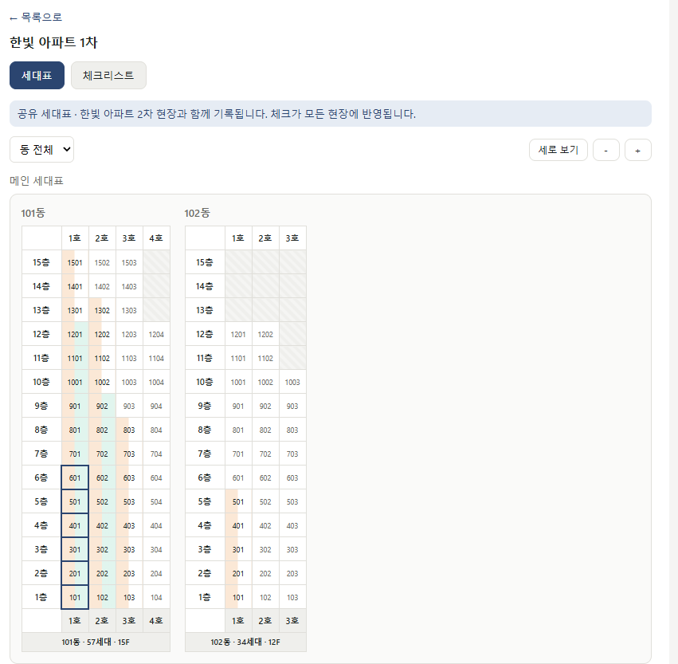
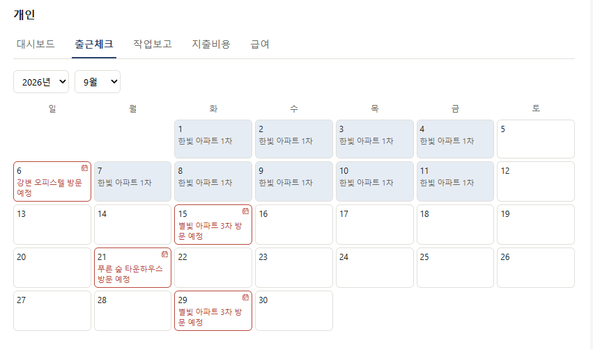
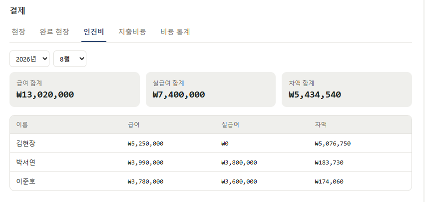
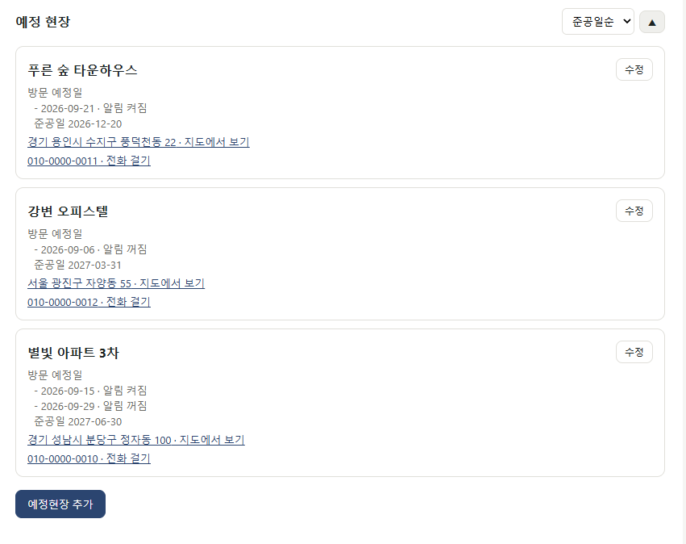

# 현장 관리 앱

여러 건설 현장의 작업 진행률·인력·정산을 통합 관리하는 PWA입니다.

> 이 저장소는 포트폴리오 공개용 사본입니다. 실제 운영 데이터는 담겨 있지 않고,
> 데모 사이트는 운영과 분리된 별도 Supabase·Cloudflare 프로젝트에 예시 데이터로 채워져 있습니다.

## 데모

- **배포 주소**: https://construction-site-app-demo.pages.dev
- **테스트 계정**: `test@test.com` / `test1234!@#$` (팀장 권한)

회원가입은 막혀 있습니다. 위 계정으로 로그인해 둘러보세요.

## 스크린샷

| 세대표 | 출근 체크 |
|---|---|
|  |  |

| 인건비 정산 | 예정 현장 |
|---|---|
|  |  |

## 핵심 기능

**세대표** — 동·라인별 층수가 제각각인 아파트 구조를 그리드로 표현합니다. 경량/합지 작업을 한 칸의 좌우 절반씩 칠해, 어느 세대가 어디까지 진행됐는지 한 화면에서 읽힙니다. 공정이 하나뿐인 내장 현장은 칸 전체를 한 색으로 칠하고 체크 하나로 완료를 판정합니다 — 같은 화면이 현장 종류에 따라 다르게 동작합니다. 칸마다 실제 호수(1501, 1405…)가 적히고, 동 아래에는 현장 도면처럼 호수·코어(연속된 같은 코어는 병합)·총 세대수·최고층이 붙습니다. 동이 많은 대단지는 공구 단위로 묶어, 상단에서 공구를 고르면 그 공구의 동만 남습니다(고른 공구와 동은 현장별로 기억합니다).

**세대표 이미지·작업보고** — 세대표를 Canvas에 직접 그려 가로형 이미지로 내려받습니다. 작업보고는 오늘 내가 처리한 체크·미타공·체크리스트를 정리하고, 오늘 작업한 세대를 빨간 테두리로 표시해 카카오톡 공유로 보냅니다(텍스트는 클립보드 복사, 이미지는 공유 시트). 체크한 호수를 하나씩 나열하면 카톡에서 읽기 힘들 만큼 길어져서 층 단위로 묶습니다 — 층을 다 했으면 "1~10층 전체", 코어 정보가 있고 한 코어를 다 했으면 "6~10층 1 core", 나머지는 "6~10층 01~02호". 실제 데이터에서 267자가 35자로 줄었습니다. 빠뜨린 보고를 위해 지난 날짜도 고를 수 있지만, 오늘 작업을 다른 날짜로 잘못 보내지 않도록 들어올 때는 항상 오늘로 시작하고, 지난 날짜의 세대표는 그날 끝난 시점의 상태로 다시 그립니다.

**여러 현장이 세대표 하나를 공유** — 같은 아파트 2차·3차처럼 도면이 같은 현장은 세대표를 함께 씁니다. 모양만 복사하는 게 아니라 경량·합지·석고 시공·미타공 기록이 같은 데이터라, 어느 현장에서 체크해도 양쪽에 반영됩니다. 공유 중이라는 사실은 배너와 배지로 항상 보이게 했습니다. 기록은 하나로 공유하되, 체크·미타공마다 "어느 현장 화면에서 했는지"를 따로 남겨 작업보고는 본인이 실제로 작업한 현장 기준으로 묶습니다.

**현장 타공 현황** — 현장마다 같은 평형이라도 타공 개수가 다르고, 같은 현장의 같은 타입도 옵션(확장·알파룸 등)에 따라 달라집니다. 그래서 세대 타공 수를 "현장별 타입 기본값 + 세대에 붙인 옵션 가감"으로 계산하고, 옵션은 세대표에서 드래그로 여러 세대에 한 번에 붙입니다. 팀장 이상은 현장별 전체·완료·남은 타공 수와 인원별 월·일 완료 타공 수를 한 화면에서 보고, 각자는 개인 메뉴에서 자기 실적만 봅니다. 지난 날짜에 완료한 세대를 실수로 해제하지 않도록, 이전 작업을 풀 때는 한 번 더 확인합니다.

**팀 공지와 한시적 메뉴** — 팀장이 공지를 올리면 팀원 모두의 화면 맨 위에 뜹니다. 각자 닫을 수 있지만 앱을 다시 켜면 다시 뜨고, 팀장이 내용을 고치면 닫아 둔 사람에게도 다시 보입니다(게시 시각을 버전으로 씀). 현장 안쪽 메뉴에 묻혀 잘 안 쓰이던 타공 설정은 전용 메뉴로 꺼내 미설정 세대가 남은 현장부터 보여주고, 설정이 다 끝나면 개발자가 팀별로 메뉴를 숨깁니다.

**권한 3단계** — 팀원·팀장·개발자. 메뉴 노출 제어와 DB단 RLS로 이중 방어합니다.

**멀티팀** — 여러 팀이 한 앱을 쓰되 팀끼리는 데이터가 전혀 보이지 않습니다. 개발자만 보는 팀을 전환할 수 있습니다.

**정산 자동화** — 출근 기록 × 단가로 급여를 산출하고, 각자 일한 달·현장별로 입력한 수령 급여(증빙 사진 포함)와의 차액을 관리합니다. 수령 급여는 세금이 빠진 뒤 받은 돈이라 그대로 빼면 어긋나서, 그 현장에서 일한 출근일수에 따라 정해지는 공제율로 세전 금액을 역산한 뒤 비교합니다. 공제 기준(일수·비율)은 현장마다 달라 화면에서 직접 설정하고, 모든 실급여 표시에 역산한 세전 금액을 함께 보여줍니다.

**오프라인 지원** — 세대표를 캐시해 오프라인에서도 열람할 수 있고, 출근체크·지출·세대표 편집은 큐에 쌓아뒀다가 온라인이 되면 순서대로 전송합니다. 현장은 통신이 불안정한 곳이 많습니다.

**작업 로그** — 모든 체크·취소·처리 이력을 시각·처리자와 함께 기록합니다.

## 기술 스택

| 영역 | 선택 | 이유 |
|---|---|---|
| 프론트 | React + Vite | 빠른 빌드, PWA 플러그인 생태계 |
| 배포 형태 | PWA | 앱스토어 심사 없이 안드로이드·iOS 동시 지원, 배포 비용 0원 |
| DB/인증 | Supabase | 관계형 데이터 구조에 적합, RLS로 권한을 DB단에서 강제 |
| 호스팅 | Cloudflare Workers | 정적 자산 배포 무료 제공량이 넉넉하고 상업적 이용 허용 |
| 스타일 | 순수 CSS | 의존성 없이 토큰 기반으로 관리 |

## 설계 결정

**왜 네이티브 앱이 아니라 PWA인가**

사내 소수 인원용 도구라 스토어 배포가 불필요했고, 새 버전 배포도 빌드 후 한 번의 배포로 끝나 별도 업데이트 절차가 없습니다.

**왜 Firebase가 아니라 Supabase인가**

현장→동→세대, 인원→출근→정산처럼 참조 관계가 많은 데이터라 관계형 DB가 맞았습니다. NoSQL이었다면 "이 현장 인원의 이번 달 출근일수" 같은 조회를 위해 데이터를 여러 곳에 복제해야 했을 겁니다.

**권한을 프론트에서만 막지 않은 이유**

메뉴를 숨기는 건 UI 편의일 뿐 보안이 아닙니다. Postgres RLS로 DB 레벨에서 강제해, API를 직접 호출해도 권한 밖 데이터는 반환되지 않습니다.

**RLS만 믿으면 안 되는 곳: `security definer` 함수의 실행 권한**

팀 이동·인원 목록처럼 RLS를 넘어서야 하는 기능은 `security definer` 함수로 열고 함수 안에서 `if not is_dev() then raise`로 막았습니다. 그런데 새 기능의 권한을 역할별로 트랜잭션 안에서 검증하다가, 로그인하지 않은 호출이 이 검사를 그냥 지나친다는 걸 발견했습니다. 원인은 두 가지가 겹친 것이었습니다. Supabase는 public 스키마의 함수에 `anon` 실행 권한을 기본으로 주는데 `revoke ... from public`만으로는 이 권한이 빠지지 않았고, 비로그인이면 `is_dev()`가 false가 아니라 **null**을 돌려주는데 plpgsql의 `if not null`은 참이 아니라서 `raise`까지 가지 않았습니다. 앱에 들어 있는 공개 키만으로 개발자 전용 함수가 실행될 수 있는 상태였습니다. `is_dev()`/`is_manager()`가 `coalesce(..., false)`로 항상 true/false만 돌려주게 하고, 로그인해야 쓰는 함수에서 `anon` 권한을 회수하고, 앞으로 만드는 함수에도 `anon` 권한이 저절로 붙지 않도록 기본 권한을 바꿨습니다. 빌드·린트·화면 테스트로는 드러나지 않는 종류라, 이후 권한 변경은 역할을 바꿔 가며 실제로 호출해 보는 검증을 거칩니다.

**세대표 공유를 다대다 테이블로 만들지 않은 이유**

체크·미타공·로그가 전부 `building_id`로 저장되므로, 여러 현장이 같은 `buildings` 행을 보게만 하면 데이터는 자연히 공유됩니다. 동을 현장에서 떼어내는 큰 스키마 변경 대신 `sites.sheet_source_id` 한 컬럼으로 해결했고, 값이 `null`이면 기존 동작 그대로라 이미 있는 현장은 영향을 받지 않았습니다. 참조가 사슬처럼 이어지면 세대표를 어디서 찾을지 정할 수 없어, 트리거로 "원본 1 : 참조 N" 한 단계만 허용합니다.

**타공 수를 저장하지 않고 매번 계산하는 이유, 모르는 값을 0으로 세지 않는 이유**

타입별 타공 수는 현장이 진행되면서 자주 고쳐집니다. 완료 시점의 타공 수를 저장해 두면 값을 고칠 때마다 과거 기록을 일괄 보정해야 하므로, 세대표 완료 판정(경량·합지)과 타입표·옵션만 두고 조회할 때 계산합니다. 대신 타입이 없거나 타공 수가 비어 있는 세대를 0으로 세면 합계가 틀려도 아무도 알아채지 못하기 때문에, 이런 세대는 합계에서 빼고 "미설정 N세대"로 따로 드러냅니다. 기존 세대표에 적혀 있던 타입 이름은 마이그레이션에서 타공 수 없이 옮겨 두어, 도입 첫날부터 무엇을 채워야 하는지 보이게 했습니다.

**체크를 풀어도 처리자·시각을 지우지 않는 이유**

세대표는 드래그로 여러 칸을 한 번에 칠하고 지웁니다. 예전에는 체크를 풀면 처리자·시각을 비웠기 때문에, 며칠 전에 끝낸 세대를 드래그하다 실수로 풀었다가 다시 칠하면 "오늘, 나"로 새로 찍혔습니다. 그러면 지난 작업이 오늘 작업보고에 들어가고, 타공 현황의 월별 실적도 옮겨졌습니다. 그래서 풀 때는 체크 여부만 끄고 해제 시각을 따로 남깁니다. **푼 날 안에** 다시 칠하면 실수로 보고 원래 기록을 되살리고, 다음 날 이후에 칠하면 실제로 다시 작업한 것으로 보고 새로 찍습니다. 이 판단은 오프라인 큐에서도 전송 시점이 아니라 실제로 누른 시점을 기준으로 합니다. 이렇게 하면 해제된 행에도 처리자·시각이 남으므로, 그 값을 읽는 작업보고 같은 곳은 체크된 행만 보도록 조건을 맞췄습니다.

**멀티팀을 별도 DB가 아니라 `team_id` + RESTRICTIVE 정책으로 나눈 이유**

팀마다 Supabase 프로젝트를 따로 두면 무료 플랜의 프로젝트 수 제한에 곧 걸리고, 마이그레이션·백업도 팀 수만큼 반복해야 합니다. 그래서 단일 DB에 `team_id`를 두되, 이미 테이블마다 촘촘히 짜둔 권한 정책은 건드리지 않고 테이블마다 RESTRICTIVE 정책 `team_id = current_team_id()` 하나만 더했습니다. RESTRICTIVE는 기존 정책과 AND로 묶이므로 "원래 볼 수 있던 것 중 우리 팀 것만" 보이게 되어, 기존 권한 로직을 다시 검증할 필요가 없었습니다. `team_id` 기본값도 `current_team_id()`라 앱의 insert 코드는 한 줄도 바뀌지 않았습니다.

**화면이 검게 반전된다는 제보를 CSS 한 줄로 끝낸 과정**

일부 사용자에게만 앱이 까맣게 보인다는 제보가 있었습니다. 폰의 다크모드를 꺼도 그대로라 원인이 아니었고, 스크린샷에서 다크모드용으로 흰색을 못 박아둔 세대표 칸까지 어두워진 걸 보고 CSS가 아니라 **렌더링 이후 단계**에서 색이 뒤집힌다고 좁혔습니다. 크롬 안드로이드·삼성 인터넷이 `color-scheme`을 선언하지 않은 사이트를 자동으로 어둡게 칠하는 기능이었습니다. 라이트 전용임을 `color-scheme: only light`로 선언해 차단했습니다(`only` 없이는 크롬이 여전히 반전시킵니다). 덤으로, 제 역할을 못 하고 있던 기존 다크모드 대응 CSS도 걷어냈습니다.

## 프로젝트 구조

```
src/
  api/         Supabase 쿼리 (기능별로 분리)
  components/  공용 컴포넌트
  pages/       화면 (개인·현장관리·결제·인사관리·예정현장·설정)
  lib/         Supabase 클라이언트, 오프라인 큐, IndexedDB
supabase/
  migrations/  스키마 변경 이력
docs/
  현장관리어플_기능데모.html   기능 명세이자 UI 설계도
```

## 로컬 실행

```bash
npm install
cp .env.example .env   # Supabase 값 입력
npm run dev
```

`supabase/migrations/`의 SQL을 순서대로 실행하면 스키마가 그대로 재현됩니다.

## 원본과 동기화 (사본 관리용)

원본 저장소의 변경분을 가져오고, 공개해도 안전한 상태인지 검증합니다.

```bash
./scripts/sync-from-source.sh [원본_저장소_경로]
```

`VITE_` 환경변수는 빌드 시점에 번들로 박히기 때문에, `.env`를 커밋하지 않는 것만으로는
운영 키 노출을 막을 수 없습니다. 그래서 이 스크립트는 빌드 전에 `.env`가 데모 프로젝트를
가리키는지 확인하고, 빌드 후에도 번들에 다른 프로젝트 주소나 secret 키가 섞이지 않았는지
다시 확인합니다. 하나라도 어긋나면 종료 코드 1로 중단합니다.

## 배포

데모 사이트는 Cloudflare Pages 프로젝트(`construction-site-app-demo`)에 직접 업로드합니다.
GitHub 연동이 아니라서 `main`에 푸시해도 자동으로 반영되지 않습니다. 원본을 동기화해 커밋·푸시한 뒤
`bash scripts/deploy-pages.sh`를 실행하면 빌드 → 번들에 데모 프로젝트 주소만 있는지 확인 → 배포까지
한 번에 합니다.

빌드에 쓰는 Supabase 값은 `.env.production`에 들어 있습니다. 데모 전용 프로젝트의 URL과
publishable 키라 이미 공개된 번들에 드러나는 값이고, 저장소에 고정해두면 어디서 빌드하든
항상 데모 프로젝트를 가리킵니다. Vite가 `.env.production`을 `.env`보다 우선 적용하므로
로컬에 운영 `.env`가 잘못 들어와 있어도 운영 키가 공개 번들에 실리지 않습니다.

## 변경 기록

[CHANGELOG.md](CHANGELOG.md) 참고.
